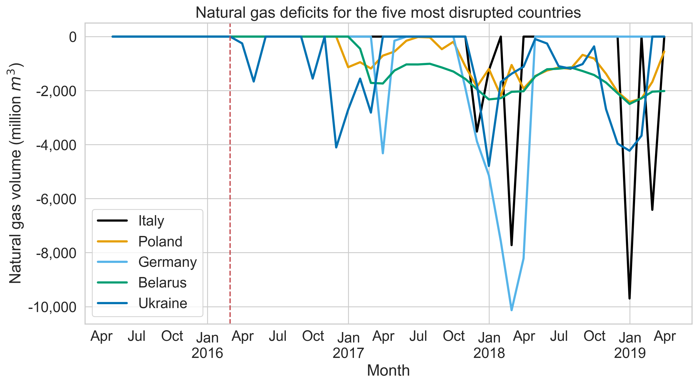

<section data-auto-animate>
<h2>Motivation</h2>
</section>
<section data-auto-animate>
<h2>Motivation</h2>

Increasing geopolitical tensions

<aside class="notes">

- Protectionism
  - IRA, Made in China
- Embargoes
  - Russian gas
</aside>

</section>
<section data-auto-animate>
<h2>Motivation</h2>

Increasing geopolitical tensions

Vulnerabilities of globalisation

<aside class="notes">

- COVID
- Shipping
  - 12 and 5% of global trade go via Suez and Panama respectively
  - Suez & Panama blockages
</aside>

</section>
<section data-auto-animate>
<h2>Motivation</h2>

Increasing geopolitical tensions

Vulnerabilities of globalisation

Need to transition to sustainable energy sources

<aside class="notes">

- Increases both
  - Quantity and
  - Types of metals required
  
</aside>
</section>

<section data-auto-animate>
<h2>Motivation</h2>

Increasing geopolitical tensions

Vulnerabilities of globalisation

Need to transition to sustainable energy sources

<aside class="notes">
For example an EV
</aside>
</section>

<section data-auto-animate>
<h2>Motivation</h2>

Increasing geopolitical tensions

Vulnerabilities of globalisation

Need to transition to sustainable energy sources

Requires a new system of trade

<aside class="notes">
Further technoogical innovations may require further modifications to the trade network 
</aside>
</section>

---

# Contributions
<!-- .slide: data-auto-animate -->
---
# Contributions
<!-- .slide: data-auto-animate -->
**Method to produce monthly Natural Gas data**

---

# Contributions
<!-- .slide: data-auto-animate -->
**Method to produce monthly Natural Gas data**
> From public data: Production, consumption, stockpiling, and trade flows

Note:
- From public data, includes
- Monthly data allows stockpiling
  - Captures variations throughout the year

---

# Contributions
<!-- .slide: data-auto-animate -->

**Method to produce monthly Natural Gas data**
> From public data: Production, consumption, stockpiling, and trade flows

**A model of global trade for optimal commodity stockpiling**

Note:
- Using this data we create

---

# Contributions
<!-- .slide: data-auto-animate -->
**Method to produce monthly Natural Gas data**
> From public data: Production, consumption, stockpiling, and trade flows

**A model of global trade for optimal commodity stockpiling**
> Trade is represented as a graph and solved as a Mixed-Integer-Linear Program

---
<!-- - Key to energy transition
- Recent geopolitical uncertainty
- High data availability
-->

<section data-auto-animate>
<h2 data-id="meth">Methodology : Data</h2>
</section>

<section data-auto-animate>
<h2 data-id="meth">Methodology : Data</h2>

Combined multiple sources of public data

</section>

<section data-auto-animate>
<h2 data-id="meth">Methodology : Data</h2>

Combined multiple sources of public data

Created a network of global Natural Gas trade

</section>

<section data-auto-animate>
<h2 data-id="meth">Methodology : Data</h2>

Combined multiple sources of public data

Created a network of global Natural Gas trade

- Pipeline

<aside class="notes">
- Includes a pipeline network in a similar style to other physical networks, e.g. Power
  
</aside>

</section>

<section data-auto-animate>
<h2 data-id="meth">Methodology : Data</h2>

Combined multiple sources of public data

Created a network of global Natural Gas trade

- Pipeline  
- LNG
  
<aside class="notes">
- Also includes LNG where the link capacity is the previous largest volume of trade
  
</aside>

</section>

<section data-auto-animate>
<h2 data-id="meth">Methodology : Optimisation</h2>
</section>

<section data-auto-animate>
<h2 data-id="meth">Methodology : Optimisation</h2>

Formulated a Non-Linear Program

<blockquote data-id="both-trade-nets">Includes both trade networks</blockquote>
</section>
<section data-auto-animate>
<h2 data-id="meth">Methodology : Optimisation</h2>

Formulated a Non-Linear Program

<blockquote data-id="both-trade-nets">Includes both trade networks</blockquote>

Linearised to a bilinear Mixed Integer Program

<blockquote>Using big-M constraints</blockquote>
<aside class="notes">
- Provides guarantees of global optimality and is faster
  
</aside>

</section>

<section data-auto-animate>

Solves a problem over

</section>
<section data-auto-animate>

Solves a problem over

48 months

</section>
<section data-auto-animate>

Solves a problem over

48 months

126 countries

</section>
<section data-auto-animate>

Solves a problem over

48 months

126 countries

1660 trade links

</section>
<section data-auto-animate>

Solves a problem over

48 months

126 countries

1660 trade links

to global optimality in 

</section>

<section data-auto-animate>

to global optimality in 

<h2 class="r-fit-text">$2.09$s </h2>

vs 12.9s for the NLP

</section>

---

# Our disruption
<!-- .slide: data-auto-animate -->
> Reduce Russian gas import by 20% per month from February

Note:
- This is a synthetic scenario
---
# Our disruption
<!-- .slide: data-auto-animate -->
> Reduce Russian gas import by 20% per month from February

- Europe is trying to reduce reliance on Russia

---

# Our disruption
<!-- .slide: data-auto-animate -->
> Reduce Russian gas import by 20% per month from February

- Europe is trying to reduce reliance on Russia  
- Russia invaded Ukraine in February

Note:
- February was chosen as Russia invaded Ukraine in February 2022
- Chosen the month matters as it affects the ability to stockpile
  - From a gas perspective February is good, it is when consumption starts to reduce

---

<!-- <section data-auto-animate>
<h3>Our disruption</h3>

<blockquote>Reduce Russian gas import by 20% per month from February</blockquote></dev>
</section>
<section data-auto-animate>
<h3>Our disruption</h3>

<blockquote>Reduce Russian gas import by 20% per month from February</blockquote></dev>

Europe is trying to reduce reliance on Russia

</section>
<section data-auto-animate>
<h3>Our disruption</h3>

<blockquote>Reduce Russian gas import by 20% per month from February</blockquote></dev>

Europe is trying to reduce reliance on Russia

Russia invaded Ukraine in February

</section> -->

<section data-auto-animate>
<h3>Results: Trade capacity</h3>

</section>
<section data-auto-animate>
<h3>Results: Trade capacity</h3>
 

Pipeline worse affected

</section>
<section data-auto-animate>
<h3>Results: Trade capacity</h3>
 

Pipeline worse affected

Little Russian export capacity by Jan 2017

</section>
<section data-auto-animate>
<h3>Results: Trade capacity</h3>
 

Pipeline worse affected

Little Russian export capacity by Jan 2017

</section>

<section>

After disruption

<h2 class="r-fit-text">$45.7\%$ </h2>

of flows changed

</section>

---

  <section data-auto-animate>
  <h3>Results: Natural Gas deficit</h3>
  
  </section>
  <section data-auto-animate>
  <h3>Results: Natural Gas deficit</h3>
  
  
No deficit before disruption  

  </section>
  <section data-auto-animate>
  <h3>Results: Natural Gas deficit</h3>
  
  
No deficit before disruption  

  
Large pipeline importers worst affected

  </section>

---

<!-- <section>

<iframe src="https://opt-viewer.joshkirk.co.uk/" width="800" height="600" style="border:none;"></iframe>
</section> -->

<section>
<h2 class="r-fit-text">Interactive results</h2>
</section>
<section data-background-iframe="https://opt-viewer.joshkirk.co.uk/" data-preload data-background-interactive>
</section>

---
### Policy implications
<!-- .slide: data-auto-animate -->

*Enables a user to test multiple scenarios*
  - Governments can explore the implications of a policy <!-- .element: class="fragment" -->
    - Trade embargoes
    - Stockpiling 
  - Traders and/or governments can consider optimal stockpiling <!-- .element: class="fragment" -->

---

# Future work
<!-- .slide: data-auto-animate -->

Include shipping (AIS) data
  - Minimise shipping emissions <!-- .element: class="fragment" -->
  - Disrupt shipping corridors <!-- .element: class="fragment" -->

---

# Future work
<!-- .slide: data-auto-animate -->

Include shipping (AIS) data
  - Minimise shipping emissions 
  - Disrupt shipping corridors 

Apply methods to other commodities
  - Food <!-- .element: class="fragment" -->
  - Rare earth Metals <!-- .element: class="fragment" -->
